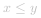
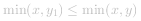
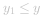
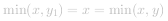

### 📺视频题解  


### 📖文字题解
#### 方法一：双指针

**说明**

本题是一道经典的面试题，最优的做法是使用「双指针」。如果读者第一次看到这题，不一定能想出双指针的做法。

**分析**

我们先从题目中的示例开始，一步一步地解释双指针算法的过程。稍后再给出算法正确性的证明。

题目中的示例为：

```
[1, 8, 6, 2, 5, 4, 8, 3, 7]
 ^                       ^
```

在初始时，左右指针分别指向数组的左右两端，它们可以容纳的水量为  。

此时我们需要移动一个指针。移动哪一个呢？直觉告诉我们，应该移动对应数字较小的那个指针（即此时的左指针）。这是因为，由于容纳的水量是由

*
两个指针指向的数字中较小值 * 指针之间的距离
*

决定的。如果我们移动数字较大的那个指针，那么前者「两个指针指向的数字中较小值」不会增加，后者「指针之间的距离」会减小，那么这个乘积会减小。因此，我们移动数字较大的那个指针是不合理的。因此，我们移动 **数字较小的那个指针**。

> 有读者可能会产生疑问：**我们可不可以同时移动两个指针？** 先别急，我们先假设 **总是移动数字较小的那个指针** 的思路是正确的，在走完流程之后，我们再去进行证明。

所以，我们将左指针向右移动：

```
[1, 8, 6, 2, 5, 4, 8, 3, 7]
    ^                    ^
```

此时可以容纳的水量为  。由于右指针对应的数字较小，我们移动右指针：

```
[1, 8, 6, 2, 5, 4, 8, 3, 7]
    ^                 ^
```

此时可以容纳的水量为  。由于右指针对应的数字较小，我们移动右指针：

```
[1, 8, 6, 2, 5, 4, 8, 3, 7]
    ^              ^
```

此时可以容纳的水量为  。两指针对应的数字相同，我们可以任意移动一个，例如左指针：

```
[1, 8, 6, 2, 5, 4, 8, 3, 7]
       ^           ^
```

此时可以容纳的水量为  。由于左指针对应的数字较小，我们移动左指针，并且可以发现，在这之后左指针对应的数字总是较小，因此我们会一直移动左指针，直到两个指针重合。在这期间，对应的可以容纳的水量为： ， ， 。

在我们移动指针的过程中，计算到的最多可以容纳的数量为 *49*，即为最终的答案。

下面的动画也给出了这个示例的过程：

         

**证明**

为什么双指针的做法是正确的？

> 双指针代表了什么？

双指针代表的是 **可以作为容器边界的所有位置的范围**。在一开始，双指针指向数组的左右边界，表示 **数组中所有的位置都可以作为容器的边界**，因为我们还没有进行过任何尝试。在这之后，我们每次将 **对应的数字较小的那个指针** 往 **另一个指针** 的方向移动一个位置，就表示我们认为 **这个指针不可能再作为容器的边界了**。

> 为什么对应的数字较小的那个指针不可能再作为容器的边界了？

在上面的分析部分，我们对这个问题有了一点初步的想法。这里我们定量地进行证明。

**考虑第一步**，假设当前左指针和右指针指向的数分别为 *x* 和 *y*，不失一般性，我们假设  。同时，两个指针之间的距离为 *t*。那么，它们组成的容器的容量为：

 

我们可以断定，**如果我们保持左指针的位置不变，那么无论右指针在哪里，这个容器的容量都不会超过 *x * t* 了**。注意这里右指针只能向左移动，因为 **我们考虑的是第一步**，也就是 **指针还指向数组的左右边界的时候**。

我们任意向左移动右指针，指向的数为 *y_1*，两个指针之间的距离为 *t_1*，那么显然有 *t_1 < t*，并且  ：

- 如果  ，那么  ；

- 如果 *y_1 > y*，那么  。

因此有：

 

即无论我们怎么移动右指针，得到的容器的容量都小于移动前容器的容量。也就是说，**这个左指针对应的数不会作为容器的边界了**，那么我们就可以丢弃这个位置，**将左指针向右移动一个位置**，此时新的左指针于原先的右指针之间的左右位置，才可能会作为容器的边界。

这样以来，我们将问题的规模减小了 *1*，被我们丢弃的那个位置就相当于消失了。**此时的左右指针，就指向了一个新的、规模减少了的问题的数组的左右边界**，因此，我们可以继续像之前 **考虑第一步** 那样考虑这个问题：

- 求出当前双指针对应的容器的容量；

- 对应数字较小的那个指针以后不可能作为容器的边界了，将其丢弃，并移动对应的指针。

> 最后的答案是什么？

答案就是我们每次以双指针为左右边界（也就是「数组」的左右边界）计算出的容量中的最大值。

```C++ [sol1-C++]
class Solution {
public:
    int maxArea(vector<int>& height) {
        int l = 0, r = height.size() - 1;
        int ans = 0;
        while (l < r) {
            int area = min(height[l], height[r]) * (r - l);
            ans = max(ans, area);
            if (height[l] <= height[r]) {
                ++l;
            }
            else {
                --r;
            }
        }
        return ans;
    }
};
```

```Java [sol1-Java]
public class Solution {
    public int maxArea(int[] height) {
        int l = 0, r = height.length - 1;
        int ans = 0;
        while (l < r) {
            int area = Math.min(height[l], height[r]) * (r - l);
            ans = Math.max(ans, area);
            if (height[l] <= height[r]) {
                ++l;
            }
            else {
                --r;
            }
        }
        return ans;
    }
}
```

```Python [sol1-Python3]
class Solution:
    def maxArea(self, height: List[int]) -> int:
        l, r = 0, len(height) - 1
        ans = 0
        while l < r:
            area = min(height[l], height[r]) * (r - l)
            ans = max(ans, area)
            if height[l] <= height[r]:
                l += 1
            else:
                r -= 1
        return ans
```


**复杂度分析**

- 时间复杂度：*O(N)*，双指针总计最多遍历整个数组一次。

- 空间复杂度：*O(1)*，只需要额外的常数级别的空间。